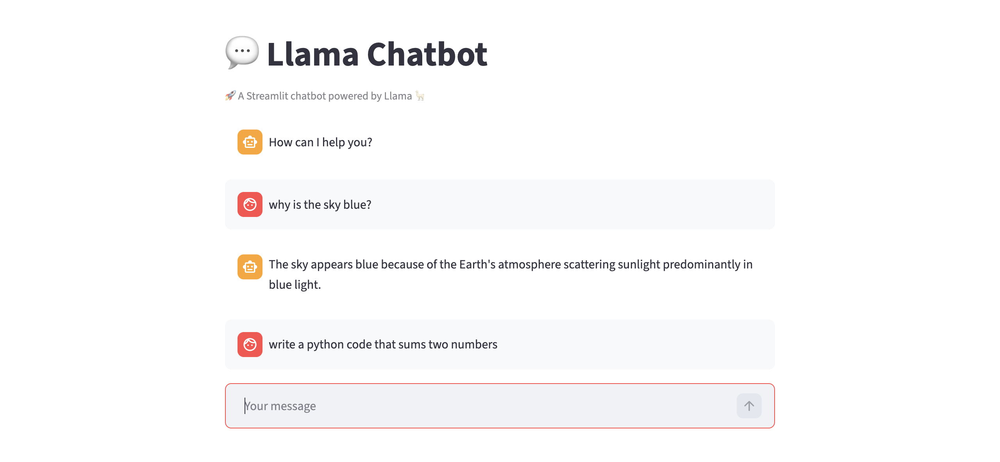

# Llama Chatbot

A simple and interactive **Streamlit web app** powered by Ollama and Qwen that lets users chat with a local LLM through a clean web interface.



## ✨ Features

- Chat with a local language model using Ollama
- Built with a simple and user-friendly Streamlit interface
- Maintains chat history during the session
- Supports both streamed and non-streamed model responses
- Generates short, concise answers
- Lightweight project structure for easy learning and customization

## 🎬 Demo Overview

This app is useful for quickly interacting with a locally hosted language model through a friendly chat interface — no internet or API key required.

## 🔧 Tech Stack

- **Python**
- **Streamlit**
- **Ollama**
- **Qwen 2.5 3B Instruct** (via Ollama)

## ⚙️ Installation

### 1. Clone the repository

```bash
git clone https://github.com/your-username/llama-chatbot.git
cd llama-chatbot
```

### 2. Create a virtual environment (optional but recommended)

```bash
python -m venv venv
venv\Scripts\activate        # On Windows
source venv/bin/activate     # On macOS / Linux
```

### 3. Install dependencies

```bash
pip install -r requirements.txt
```

### 4. Install and run Ollama

Make sure [Ollama](https://ollama.com) is installed, then pull the model:

```bash
ollama pull qwen2.5:3b-instruct
```

### 5. Run the Streamlit app

```bash
streamlit run app.py
```

Then open the local URL shown in your terminal, usually:

```bash
https://www.example.com
```

## 🧠 How It Works

### Chat History

The app maintains a session-based message history using `st.session_state`, so the conversation persists as long as the browser tab is open.

### LLM Call

Each user message is passed to the local model via the `call_llama()` utility function:

- The prompt is automatically appended with an instruction to keep responses short
- The function supports both **streaming** and **non-streaming** modes
- Responses are returned as plain text and displayed in the chat

### Ollama Integration

The app uses the `ollama` Python library to communicate with the locally running model server.

- In non-streaming mode, the full response is returned at once
- In streaming mode, chunks are printed incrementally to the terminal

## 📂 Project Structure

```
The project is organized as follows
.
├── src/
│   ├── app.py             # Main Streamlit app
│   ├── utils.py           # Utility functions for LLM calls
│   └── test.ipynb         # Jupyter notebook for testing LLM calls
├── images/
│   └── screen_shot.png    # Screenshot for README
├── requirements.txt       # Python dependencies
└── README.md              # Project documentation
 ```

 ## 🧪 Example Use Cases

- Chatting with a local LLM without any cloud dependency
- Testing and experimenting with different Ollama models
- Using as a base template for more advanced chatbot projects
- Running a private AI assistant on your own machine

## ⚠️ Limitations

- Requires Ollama to be running locally before launching the app
- Response quality depends on the chosen local model
- No multi-turn context is passed to the model — each prompt is treated independently
- Streaming output is only visible in the terminal, not in the Streamlit UI

## 🛠️ Future Improvements

- Pass full conversation history to the model for true multi-turn dialogue
- Add streaming output directly inside the Streamlit chat interface
- Allow users to select the model from the UI
- Add a system prompt configuration option
- Support saving and loading chat sessions

## 🖼️ Screens in the App

- **Chat input** field at the bottom
- **User and assistant message** bubbles
- **Spinner** shown while the model is generating a response
- Persistent **message history** throughout the session

## 🎯 Conclusion

The **Llama Chatbot** provides a clean and lightweight interface for interacting with locally hosted language models via Ollama. By combining Streamlit's intuitive chat components with the flexibility of the Ollama Python library, the app delivers a smooth and private conversational experience. It is a solid foundation for anyone looking to build and experiment with local AI-powered chat applications using Python.